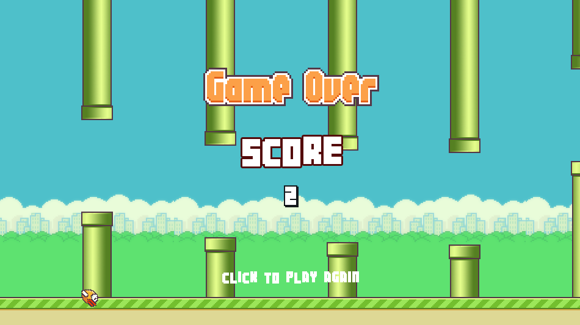

<p align="center">
  <a href="https://discord.gg/SHdJhcWvQD">join us on Discord<br>
    
  </a>
</p>


What is `kengi`?

* a game engine (=a set of tools whose purpose is the rapid prototyping of video games)
* a wrapper around the popular [pygame lib](https://github.com/pygame/pygame)
* the abbreviation for [__k__]ata [__engi__]ne

Why "kata"?
[Kata.Games](https://kata.games) denotes a new gaming platform that helps indie game developers to create and share
digital experiences easily, all around the globe!
Via this innovative platform, we're proud to publish all kinds of games powered by `kengi`.


## Design principles

1. Code readability matters. Clean, expressive code is not a luxury!

2. `kengi` ships with several game templates. Proving that one
can create real games with minimal effort using our tool is important.
Game templates are easy to customize.

3. `kengi` encourages the use of patterns such as the Mediator or MVC,
but people should remain free to use their favorite coding style.


## Feature Overview
The game engine comes packed with useful features:
1. global event queue (simplifies the use of both the Mediator and the MVC design patterns)
2. gamestate stack, state management via events 
3. simple GUI creation: buttons, checkboxes, *etc.* 
4. tileset loading, sprite animation
5. tilemap parser (based on `.tmx` or `.tsj` file formats)
6. mathematical tools: matrices ; vectors ; gradient noise functions (->procedural generation)
7. helper classes for coding roguelike or RPG games
8. helper classes for coding card games (Poker, Blackjack, *etc.*)
9. helper classes for adding artificial opponents/intelligent entities (NPCs) to your game
10. ...


## Getting started
To get started, first, copy the source-code (as a .zip file) from Github. It is recommended to download the last tagged version,
(not the most recent commit) because most recent dev versions might be unstable.

Once you have the files on your computer, use the command line to navigate to the root folder of the project (one level below `src\`).

We use the `pip` tool to install the game engine.
Ensure that your python is a recent one (`python >=3.9`), then go to the `src` folder and proceed with the installation:
```shell
> pip install -r requirements.txt
> pip install .
```
In this way, you will be able to use `kengi` from any folder on your system.

You can create a first file named `test_kengi.py` and copy-paste this very basic code snippet to understand how games are built, using `kengi`:
```python
import katagames_engine as kengi

kengi.init(1, caption='my first video game, hi mom!')
pygame = kengi.pygame
screen = kengi.get_surface()
gameover = False
color_idx = 0
allcolors = ('pink', 'yellow', 'purple')
bg_color = allcolors[0]
print('press ESC to exit, any key to change bg_color...')

# game loop
while not gameover:
    for ev in pygame.event.get():
        if ev.type==pygame.KEYDOWN:
            if ev.key==pygame.K_ESCAPE:
                gameover = True
            else:
                color_idx = (color_idx + 1) % len(allcolors)
    # update "game logic"
    bg_color = allcolors[color_idx]
    # update the display
    screen.fill(bg_color)
    kengi.flip()
print('game over!')
```


## Game templates
*How can you create a full game with speed and efficiency while
having more reliability in your work?*

The use of a high-quality game engine + a set of game templates is probably
the best start one can get as a game developer.
It allows you, the game creator, to bootstrap a Game Dev project easily and attain
solid results! For instance, game templates that ship with `kengi` include a flappy bird clone... 



Or, this match3 puzzle game...


And many others! 
We also have built-in color palettes to unleash users' creativity.


Feel free to study/copy all files available in this folder:
* [game_templates](https://github.com/gaudiatech/kengi/blob/master/game_templates) 

Save yourself a lot of time for your project: use `kengi` from now on ;-)

To test a game template you will need to install `kengi` (see next section)
and then run the `main.py` file found in the corresponding game template folder. Alternatively,
testing demos without installation is possible if you  open the project with an IDE like PyCharm and
configure two root folders: `src/` and `game_templates/`.


## Mini tutorial
If you're familiar with `pygame`, getting used to `kengi` is really easy.
Navigate to the `src/` folder. There, you see a very basic example that uses only pygame:
* [demo-a-pygame.py](https://github.com/gaudiatech/kengi/blob/master/src/demo-a-pygame.py)

Now try to notice what is different when one uses `kengi` (only minor details change):
* [demo-a-kengi-straightf.py](https://github.com/gaudiatech/kengi/blob/master/src/demo-a-kengi-straightf.py)

This is only one way to use `kengi` but it's most likely that you will start with this one,
if you already have some background in creating games using `pygame`.
Actually, one can see `kengi` as a mere wrapper around pygame. Everything that you can do
with `pygame` can be done the same way when using `kengi`, but `kengi` also unlocks
many new features that are very worthy of interest!

To explore more possibilities you can take a glimpse of the next demo
that implements the same thing but using the M-V-C pattern:
* [demo-a-kengi-mvc.py](https://github.com/gaudiatech/kengi/blob/master/src/demo-a-kengi-mvc.py)

Note that this program starts with the declaration
of a list of user-defined events. User-defined events can have attributes.
These events, just like regular pygame events, are processed via a standard method
`proc_event` that you need to re-define when you sub-class
`kengi.event.EventReceiver`...

## General goal
As a wise man (Joel Spolsky) once said:
> "It’s Harder to Read Code than to Write it"

Our general goal is to empower you to:

1. **write standardized therefore very easy-to-read code**

Readability is not to overlook! If you take care of your code readability you'll encounter
30% fewer bugs, you will fix any bug faster, etc. It works like magic!

2. **write a type of code that can evolve easily**

By using our *built-in event system* along with the *M-V-C pattern*, you can reach
an amazing level of code flexibility.

3. **be more productive**

And, interestingly enough:

5. **distribute your newly created games via our awesome
[Kata.Games](https://kata.games) platform!**

In this way, your whole game and the python source-code that it's made of, can be
played directly by modern browser (Chrome, Brave, etc.). *A world premiere!*


## License
Currently, materials in this repo are all licensed under the LGPL3 license.
See the `LICENSE` file for more info.


## Contribute
Feel free to join the developer team. It's a super easy two-step process:
(a) start by forking `kengi`,
 (b) join our Discord to discuss, or create a Pull Request directly!

If you spot a bug, create an issue and tell us how to reproduce the bug.
The documentation is built via the `mkdocs` tool. Feel free to make it more user-friendly! It's as simple as modifying a few text files in the `docs/` folder.
Pull Requests are much appreciated!

Newcomers are always welcome. When `kengi` becomes a great tool, we won't forget who made
this possible!
Below we register the list of the 10 first contributors –our Hall of fame– ;-)
* [wkta-tom](https://github.com/wkta) architecture, event system, design patterns
* [tank-king](https://github.com/tank-king) fancy game templates (flappy bird, match3)
* [jwvhewitt](https://github.com/jwvhewitt) isometric engine
* ...
