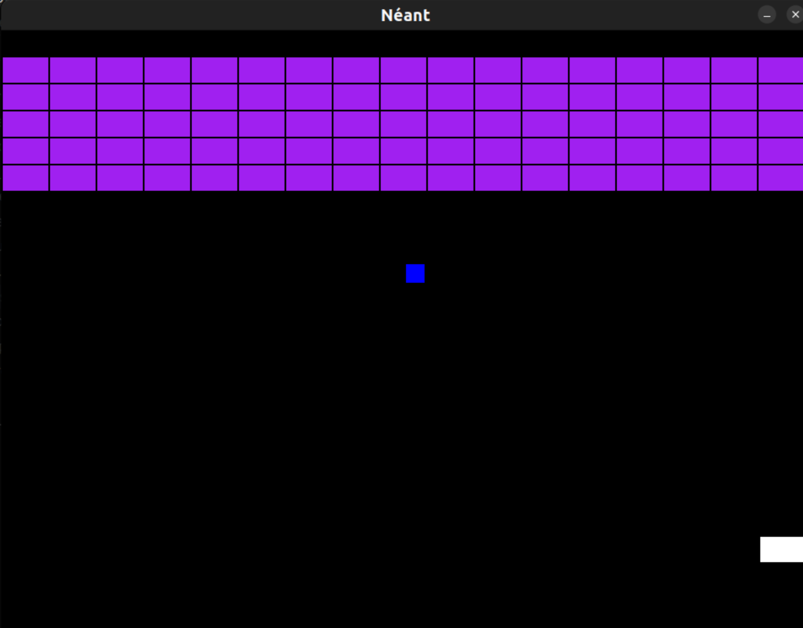

# Tutorial breakout clone

This tutorial is here to help you create a breakout type game from scratch.

This tutorial can also be used as a nice base to understand and experiment with the ECS pattern.

Note that the game in its final state is already available in the `pyved-engine` in the `pyv-cli`.


If you need further help for using PYV,
you can always refer to the
[**pyved-engine full docs homepage**](https://gaudiatech.github.io/pyved-engine/).


## Step 0. Getting Started

### Either Download the init, or just the template

If you want to build upon the foundation of the breakout template, you can download it by doing the following

```shell
pyv-cli init myGame
pyv-cli play myGame
```
And choose the Breakout template.

Note that this tutorial won't focus on building upon the foundation, instead the focus is on how to build on nothing and manage to create such a game.

So for this, we will choose the empty template instead.

Your folder should look something like this.

    .
    └── YourBundleName/
        ├── cartridge/
        │   ├── gamedef.py
        │   ├── __init__.py
        │   ├── metadat.json
        │   └── pimodules.py
        └── launch_game.py


## Step 1 : Create the necessary files for the ECS 

As of now, all of the files used in an ECS configuration aren't auto generated, this might change in the future, but since you're here to learn everything on how to create a game using Pyved and ECS, let's get into it.

Go inside `cartridge` and create the following file, they'll be useful later :

- shared.py
- systems.py
- world.py

These files will store nearly all of your ECS code.

## Step 2 : Creating the foundations

In this part, you will learn how to create your first entities and draw them on your screen.

### Creation of Archetypes and Entities

First, let's create all of our constants in our `shared.py` :

```PY
screen = None
blocks_pop = None
prev_time_info = None
end_game_label = None  # != None means player cannot move bc he/she lost

# (Size of break-out blocks)
BLOCK_W = 54
BLOCK_H = 30
BLOCK_SPACING = 2
SCR_WIDTH = 960
SCR_HEIGHT = 720
LIMIT = SCR_WIDTH / (BLOCK_W + BLOCK_SPACING)
WALL_X, WALL_Y = 4, 80

# physics
PL_WIDTH, PL_HEIGHT = 110, 25
PLAYER_SPEED = 280
MAX_XSPEED_BALL = 225.0
YSPEED_BALL = 288.0

# ball-related
BALL_INIT_POS = 480, 277
BALL_SIZE = 22
```
We will use all of those constants laters, but they are important.


Secondly we will create all of our entities, let's head inside `gamedef.py`

``` py
from . import pimodules
from . import shared
from . import systems
from .world import world #This will change later to import specific functions

pyv = pimodules.pyved_engine
@pyv.declare_begin
def init_game(vmst=None):
    pyv.init(wcaption='Néant')
```

Let's create our archetypes, this is how we will create the different entities : 

```py
    pyv.define_archetype('player', ('body', 'speed', 'controls'))
    pyv.define_archetype('block', ('body', ))
    pyv.define_archetype('ball', ('body', 'speed_Y', 'speed_X'))
```

We can now go into `world.py`, to create our entities :

```py
import random
from . import pimodules
from . import shared

pyv = pimodules.pyved_engine
pygame = pyv.pygame


def player_create():
    pyv.new_entity(
        archetype='player',
        speed=0.0,
        controls={'left': False, 'right': False},
        body=pygame.rect.Rect(shared.SCR_WIDTH // 2, 635, shared.PL_WIDTH, shared.PL_HEIGHT)
    )
```

We are creating a create_player function, this will create the entities with our default settings, we will do the same for every entity present in our game.

We give it, a speed, some controls, here we only give it left and right, as we don't need other directions.

And finally a body, so that our player have a hitbox.

```py
def ball_create():
    if random.choice((True, False)):
        # we select the right dir.
        initial_vx = random.uniform(0.33 * shared.MAX_XSPEED_BALL, shared.MAX_XSPEED_BALL)
    else:
        initial_vx = random.uniform(-shared.MAX_XSPEED_BALL, -0.33 * shared.MAX_XSPEED_BALL)

    pyv.new_entity(
        archetype='ball',
        speed_X=initial_vx,
        speed_Y=shared.YSPEED_BALL,
        body=pygame.rect.Rect(shared.BALL_INIT_POS[0], shared.BALL_INIT_POS[1], shared.BALL_SIZE, shared.BALL_SIZE)
    )
```

We will create our ball too, we will keep the same logic, and create it's attributes, speed_X and Y in order to move in both directions, and a hitbox to detect collisions.


```py
def blocks_create():
    bcy = 0
    for row in range(5):
        bcy = bcy + shared.BLOCK_H + shared.BLOCK_SPACING
        bcx = -shared.BLOCK_W
        for column in range(round(shared.LIMIT)):
            bcx = bcx + shared.BLOCK_W + shared.BLOCK_SPACING
            pyv.new_entity(
                archetype='block',
                body=pygame.rect.Rect(0 + bcx, 0 + bcy, shared.BLOCK_W, shared.BLOCK_H)
            )
```

Here the code is a bit different, since there's more than one block, we will loop over it to generate as many entity as needed.

Here we fill the screen from left to right, and on 5 row with blocks.

We can now head back into `gamedef.py` and finalise the creation of our entities.


```py
from . import pimodules
from . import shared
from . import systems
from .world import blocks_create, player_create, ball_create


pyv = pimodules.pyved_engine
pygame = pyv.pygame


@pyv.declare_begin
def init_game(vmst=None):
    pyv.init(wcaption='Pyv Breaker')
    screen = pyv.get_surface() 
    shared.screen = screen

    pyv.define_archetype('player', ('body', 'speed', 'controls'))
    pyv.define_archetype('block', ('body', ))
    pyv.define_archetype('ball', ('body', 'speed_Y', 'speed_X'))

    blocks_create()
    player_create()
    ball_create()
    pyv.bulk_add_systems(systems)
```
Here we added the call to the different functions we made in the `world.py`, so that now, when we launch our game, we create actual entities instead of just their archetypes.

As for the line `pyv.bulk_add_systems(systems)` we will get back to it soon.

### Creating systems

The systems are an essentiel part of the ECS, it's basically all of the logic happening in the game.


Let's head inside `systems.py` :

```py
from . import shared
from . import pimodules
pyv = pimodules.pyved_engine
pyv.bootstrap_e()

__all__ = [

    'gamectrl_sys'
]

def gamectrl_sys(dt):
    pg = pyv.pygame
    for ev in pg.event.get():
        if ev.type == pg.KEYDOWN and ev.key == pg.K_ESCAPE:
            pyv.vars.gameover = True 
```

This is a base setup for a `systems.py` file, let's make it a bit more full with all of our base systems.

```py
from . import shared
from . import pimodules

pyv = pimodules.pyved_engine
pyv.bootstrap_e()

__all__ = [
    'controls_sys',
    'physics_sys',
    'rendering_sys',
    'gamectrl_sys',
    'endgame_sys'
]

def controls_sys(dt):
    #Empty for now
            
def physics_sys(dt):
    #Empty for now

def rendering_sys(dt):
    #Empty for now
        
def gamectrl_sys(dt):
    pg = pyv.pygame
    for ev in pg.event.get():
        if ev.type == pg.KEYDOWN and ev.key == pg.K_ESCAPE:
            pyv.vars.gameover = True 

def endgame_sys(dt):
    #Empty for now
```

Now, we will create our rendering system, to at least have some graphics and wrap this step up.

```py
def rendering_sys(dt):
    """
    displays everything that can be rendered
    """
    scr = shared.screen
    scr.fill((0, 0, 0))
    li_blocks = pyv.find_by_archetype('block')
    for b in li_blocks:
        pyv.draw_rect(scr, 'purple', b.body)

    pl_ent = pyv.find_by_archetype('player')[0]
    pyv.draw_rect(scr, 'white', pl_ent.body)
    if shared.end_game_label:
        lw, lh = shared.end_game_label.get_size()
        scr.blit(
            shared.end_game_label, ((shared.SCR_WIDTH-lw)//2, (shared.SCR_HEIGHT-lh)//2)
        )
    else:
        ball = pyv.find_by_archetype('ball')[0]
        pyv.draw_rect(scr, 'blue', ball.body)
```

What we do here, is first fill the screen in black, then find the different lists of entities for each archetypes.

We then simply give their hitbox a graphical representation with different colors.

Since the player and ball are alone, we just go for the first one of the list, and we iterate over the different blocks we created before.

Let's head one last time into `gamedef.py`, and add the few details missing in order to display everything fine.

```py
@pyv.declare_begin
def init_game(vmst=None):
    pyv.init(wcaption='Pyv Breaker')
    screen = pyv.get_surface() 
    shared.screen = screen

    pyv.define_archetype('player', ('body', 'speed', 'controls'))
    pyv.define_archetype('block', ('body', ))
    pyv.define_archetype('ball', ('body', 'speed_Y', 'speed_X'))

    blocks_create()
    player_create()
    ball_create()
    pyv.bulk_add_systems(systems)
```
Here we added the screen creation to our initialisation sequence, this is also where the bulk system is used, since we created a rendering system, we need to load it in our game.

Now, in order to have something displays and refresh, we will also modify our update like so:

```py
def upd(time_info=None):
    if shared.prev_time_info:
        dt = (time_info - shared.prev_time_info)
    else:
        dt = 0
    shared.prev_time_info = time_info

    pyv.systems_proc(dt)
    pyv.flip()
```
Here we use our systems, then use flip in order to display everything.

We also setup dt, this is the time info, it's used to make things run evenly, because otherwise the game would speed up or down depending of the max fps the games run at.

And now, your game should look something like this 



So, as of now, we can display things on our screen, but nothing more happens.

We will change this in the 3rd step, we will start adding movement and interactions for everything.

## Step 3 : Making our game

So, let's get all of this moving !

Go back to your `systems.py` file and now we will populate the different empty systems.

```py
def controls_sys(dt):
    #Empty for now
            
def physics_sys(dt):
    #Empty for now

def endgame_sys(dt):
    #Empty for now
```
We will start with the easiest one first, the controls.

```py
def controls_sys(dt):
    pg = pyv.pygame
    player = pyv.find_by_archetype('player')[0]
    active_keys = pg.key.get_pressed()
    if active_keys[pg.K_LEFT]:
        player.speed=-shared.PLAYER_SPEED

    elif active_keys[pg.K_RIGHT]:

        player.speed=shared.PLAYER_SPEED
    else:
        player.speed=0.0
```

Everything is pretty straightforward here; we search for our player, and then go inside the controls we defined earlier. Once we have our player, we just set the left and right key to the left and right controls we created. 

And after this, we make it move to the player speed on a certain direction, and if we don't press anything, he doesn't move. Even though we assigned movement to our keys, as of now, whenever we press the keys the speed is just reassigned, but it never applies to the player, so you can't move for now. 

Let's make it happen and go inside the game physics.

```py
def physics_sys(dt):
    
    if shared.end_game_label is not None:  # block all movements when game over
        return
    # PLAYER MOVEMENT
    player = pyv.find_by_archetype('player')[0]
    px, py = player.body.topleft
    vx = player.speed
    plwidth = player.body.w
    targetx = px + vx * dt
    if not(targetx < 0 or targetx > shared.SCR_WIDTH-plwidth):
        player.body.x = targetx
```
Again, let's find our player entity.

We take the speed property and the position as `vx` and `px`/`py` and now we change it in the next line.
`px`/`py` are equal to the player position on X and Y, `vx` is the player "speed", it would be more accurate to describe it as how much the player move for a single movement.

`targetx = px + vx * dt`
Here we create the new horizontal position, this new position will be targetx, the position in X + the "speed" * the time, and we have our new position.

Lastly, we just make our player not able to leave the screen by stopping the addition of the speed.

If everything went according to plan, you should be able to start the game and move your player block !

Easy, right ?

Now, we will make the ball move.

```py
    # ##################BALL MOVEMENT
    ball = pyv.find_by_archetype('ball')[0]
    speed_x = ball.speed_X
    speed_y = ball.speed_Y
    bpx, bpy = ball.body.topleft
    ball.body.x = bpx + dt*speed_x
    ball.body.y = bpy + dt*speed_y

    if bpx < 0:
        ball.speed_X *= -1
        ball.body.x = 0
    elif ball.body.right > shared.SCR_WIDTH:
        ball.speed_X *= -1
        ball.body.right = shared.SCR_WIDTH
    if bpy < 0:
        ball.speed_Y *= -1
        ball.body.top = 0
```

We take the same base as before, we just now have a 2 axis movement, so we have an X and Y speed.
And, same as before we apply the speed to both directions, `bpx, bpy` is the movement on X and Y axis.

We keep the same speed formula on both axes and add conditions in order to not go out of screen.

Now if you test, your ball should be moving on your screen, but will go through your player/blocks.


```py
    # ######################Collision
    if player.body.colliderect(ball.body):
        ball.body.bottom = player.body.top-4  # stick to the pad
        ball.speed_Y = -1*ball.speed_Y
```
This is how we will handle the collision, we use `colliderect` to do so. It's a simple check inbetween the different hitboxes, whenever the hitboxes touch, `colliderect` will equal to `True`.

So what we do is lookout to whenever they'll touch, if it do so, we change the direction.

And now for the last interaction, we will make the ball kill and bounce out of blocks :


```py
    blocks = pyv.find_by_archetype('block')
    for block in blocks:
        if ball.body.colliderect(block.body):
            ball.speed_Y *= -1
            pyv.delete_entity(block)
            break
```

We find all of our blocks, then apply basically the same treatment than the player one, except here, we use a delete_entity to remove the block once we collided with it.

We will now end by adding our game over system :

```py
def endgame_sys(dt):
    classic_ftsize = 38
    ball = pyv.find_by_archetype('ball')[0]
    bpy = ball.body.top
    if bpy > shared.SCR_HEIGHT:
        ft = pyv.pygame.font.Font(None, classic_ftsize)
        shared.end_game_label = ft.render('Game Over', True, (255, 255, 255))

    # has destroyed all blocks
    blocks = pyv.find_by_archetype('block')
    if not len(blocks):  # no more blocks!
        ft = pyv.pygame.font.Font(None, classic_ftsize)
        shared.end_game_label = ft.render('Great job!', True, (255, 255, 255))
```

Here we check if the ball goes under the screen, since it won't bounce back up, we consider this as a lose and display a Game Over message.
If there's no blocks left, we display a great job message to congratulate the player.

Now your game should be working ! 

And this also should be the end of the tutorial ...

But let's add a little something to make everything cuter !

```py
def interpolate_color(x, y) -> tuple:
    return 150, (x * 0.27) % 256, (y * 1.22) % 256
``` 

Add this small function in your systems.

And let's use it to color our blocks !

In your `rendering_sys` :

```py
    pyv.draw_rect(scr, interpolate_color(b.body.x, b.body.y), b.body)
```


And now your game is truly finished !