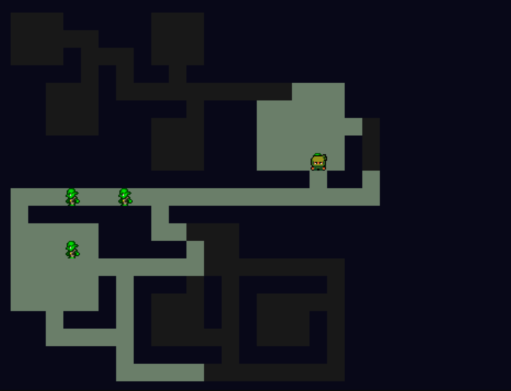

# Grid-based 2d Roguelike

This tutorial will help you to create a 2D roguelike game from the ground up.

If you want to build upon the foundation of the roguelike template, you can use the roguelike template that ships with the pyved-engine package. Indeed, we'll use the pyv-cli command to initialize the project. That command is installed when you install pyved-engine.

If you need further help for installing PYV, please refer to the Documentation Homepage.

Here is the final render of this tutorial : 




## Step 0. Getting Started :

### What is a roguelike ?

A roguelike is a type of video game where you explore dungeons, fight monsters, and find treasure.

Every time you play, the dungeon is different because it's randomly generated.

If your character dies, you start over from the beginning, losing all your progress. These games often have turn-based gameplay, meaning you and the enemies take turns to move or attack.

### Either Download the init, or just the template

If you want to follow this tutorial and recreate this roguelike game, start by downloading the empty template of the `pyv-cli`

```shell
pyv-cli init myGame
```
Choose the empty template

Start by creating the following files in the cartridge folder.

- glvars.py
- mvc_parts.py


WARNING : Since this is a pretty complex project, we recommand you try another simpler project first.
This project will take some time to be complete, as there is a lot of intertwined parts.


If you want to build upon the foundation of the rogue template, you can download it by doing the following

```shell
pyv-cli init myGame
pyv-cli play myGame
```
And choose the Rogue template.


## Step 1. Setup the MVC.

Since we are making a game using the MVC design pattern, let's go inside the `mvc_parts.py` file.

We will start by creating the different variables needed for our future code : 

```python

from . import pimodules #Import the pygame module
from . import glvars #Import a file that is empty for now
pyv = pimodules.pyved_engine # Assign the pyved engine to the var
pyv.bootstrap_e()


pygame = pyv.pygame #Assign the pygame lib to a var
EngineEvTypes = pyv.EngineEvTypes #
CogObject = pyv.Emitter #
ReceiverObj = pyv.EvListener #This allows to listen to event
Sprsheet = pyv.gfx.Spritesheet #
BoolMatrx = pyv.e_struct.BoolMatrix #
```


Let's write the commands to move our player first.

```python

class NinjamazeMod(CogObject) :


class NinjamazeView(ReceiverObj):


class NinjamazeCtrl(ReceiverObj):

```

This code is pretty straightforward, we create the 3 parts of our MVC, but are left empty for now.


## Step 2. Create the necessary functions :

Let's create the push_player function, it will allow us to update the player position :

```python

    def get_terrain(self):
        return self.rm.getMatrix()

    def push_player(self, direction):
        deltas = {
            0: (+1, 0),
            1: (0, -1),
            2: (-1, 0),
            3: (0, +1)
        }
        delta = deltas[direction]
        dest = list(self.player_pos)
        dest[0] += delta[0]
        dest[1] += delta[1]
        t = self.get_terrain()
        if t.is_out(*dest):  # out of bounds
            return
        if t.get_val(*dest) is None:  # wall
            return
        self.player_pos = dest
        self._update_vision(*dest)
        self.pev(SpecificEvTypes.PlayerMoves, new_pos=dest)

```

We define first the different possible positions we can go to, then define through the pressed key where we are supposed to move the player.
If we can't, we stop the execution, if it's a possible destination, we update the player position.


## Step 3. Move the player :


Start by going back to this part of the code : 

```python

class NinjamazeCtrl(ReceiverObj):

```

We will fill it up with the player movement : 

```python

class NinjamazeCtrl(ReceiverObj):
    def __init__(self, ref_mod):
        super().__init__()
        self.mod = ref_mod

    def on_keydown(self, ev):  # need to use EngineEvTypes, because custom event manager is active
        if ev.key == pygame.K_RIGHT:
            self.mod.push_player(0)
        elif ev.key == pygame.K_UP:
            self.mod.push_player(1)
        elif ev.key == pygame.K_LEFT:
            self.mod.push_player(2)
        elif ev.key == pygame.K_DOWN:
            self.mod.push_player(3)
        elif ev.key == pygame.K_SPACE:
            self.mod.reset_level()
        elif ev.key == pygame.K_ESCAPE:
            pyv.vars.gameover = True

```

This code is pretty straightforward, we filled our controller with movement by assigning the push player function to the arrows, a quit button on escape, and reset_level on space.

